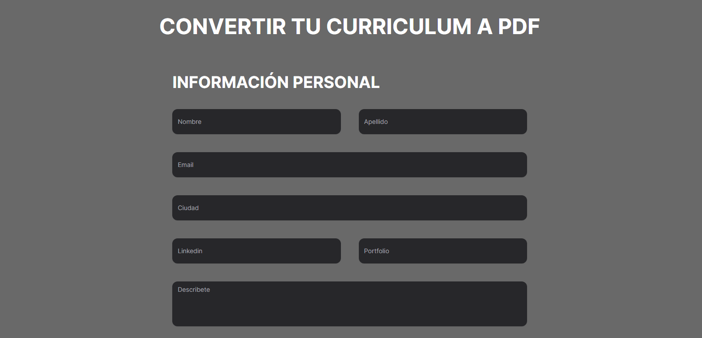
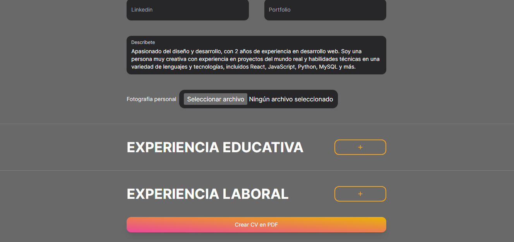
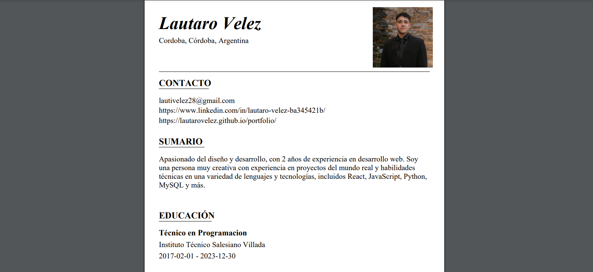

# CVToPDF
A React application which generates a CV from user entered data.


## Live demo

https://cv-to-pdf.vercel.app/



## Built with
- HTML
- Tailwind CSS
- Javascript
- Next.js
- React - JSPDF Library.
- React Hook Form
- React Hooks

## Features
The User is presented with various segments containing relating inputs and also the option to upload a portrait

After inputting their data, the user can click in the generate pdf button to download their data injected into a formatted Resume.



## Run Locally

Clone the project

```bash
  git clone https://github.com/LautaroVelez/CVToPDF.git
```

Go to the project directory

```bash
  cd CVToPDF
```

Install dependencies

```bash
  npm install
```

Start the server

```bash
  npm run dev
```